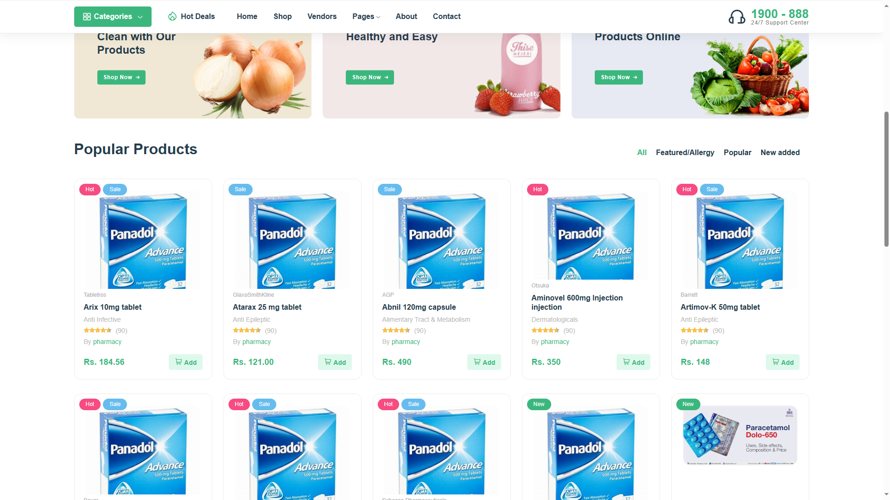

# Pharmacy Delivery App with Next.js

Welcome to the Pharmacy Delivery App, a web-based application developed with Next.js and deployed on Vercel. This README provides an overview of the app, how to set it up, and key features.



## Table of Contents

- [Overview](#overview)
- [Features](#features)
- [Getting Started](#getting-started)
- [Deployment](#deployment)
- [Contributing](#contributing)
- [License](#license)

## Overview

The Pharmacy Delivery App is designed to streamline the process of ordering and delivering pharmaceutical products to customers. It serves as a user-friendly platform that connects customers with nearby pharmacies, allowing them to browse and order medications and related items. Pharmacy staff can manage orders, and delivery personnel can ensure safe and efficient delivery to customers.

## Features

- **User Registration and Authentication**: Users can register and log in to the app securely.

- **Browse and Order Products**: Customers can view a catalog of available products, add items to their cart, and place orders.

- **Order Management**: Pharmacy staff can view and manage incoming orders, mark orders as processed, and update order statuses.

- **Real-Time Delivery Tracking**: Customers can track the status of their deliveries in real-time, including the estimated time of arrival (ETA).

- **Payment Processing**: Integration with payment gateways for secure transactions.

- **Pharmacy Locator**: Customers can find nearby pharmacies based on their location.

- **Inventory Management**: Pharmacies can update their product inventory.

- **Admin Dashboard**: Administrators have access to an admin dashboard for managing users, pharmacies, and overall system functionality.

## Getting Started

To run this application locally, follow these steps:

1. **Clone the Repository**: Clone this repository to your local machine using Git:

   ```bash
   git clone https://github.com/Ammar-Ahmad1/Pharmacy.git

2. **Install Dependencies**: Navigate to the project directory and install the required dependencies:

    ```bash
    cd pharmacy-delivery-app
    npm install

3. **Environment Variables**: Create a .env.local file in the project root and set the required environment variables. You can refer to the .env.example file for guidance.

4. **Run the Development Server**: Start the development server:
    ```bash
    npm run dev

5. **Access the App**: Open your web browser and go to http://localhost:3000.


## Deployment

You can deploy this app to your preferred hosting platform following the deployment guidelines for Next.js applications.
